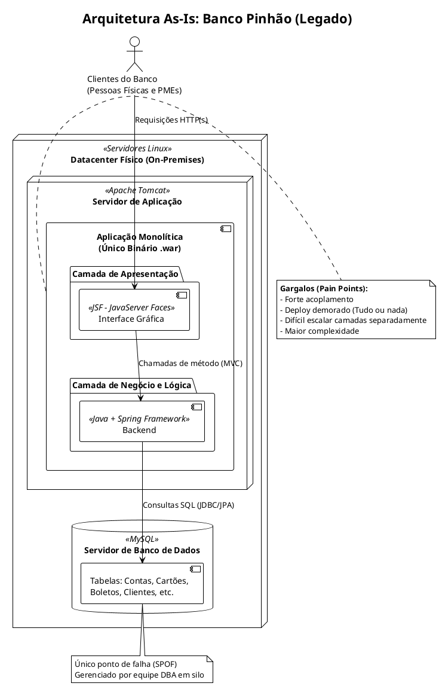
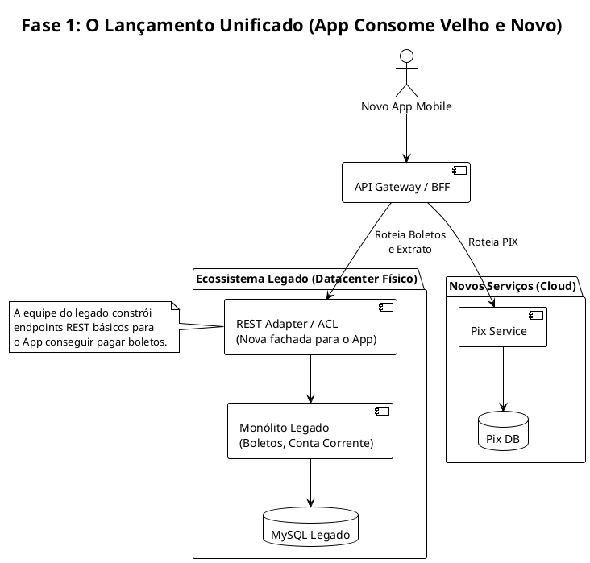
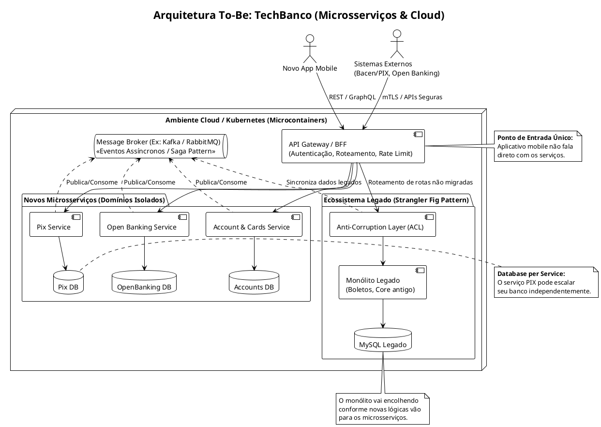

# puc-microservices
Repositório para materiais da disciplina "Arquitetura de Microsserviços e Microcontainer: o Negócio como Serviço"

# Estudo de Caso - Banco Pinhão
## Arquitetura as-is

## Fase 1: O lançamento do Mobile App

## Arquitetura to-be

