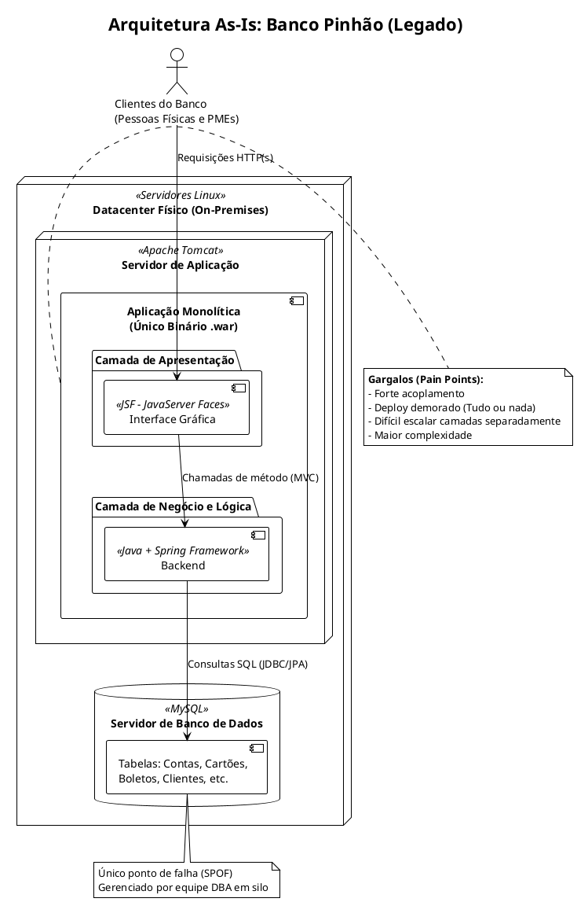
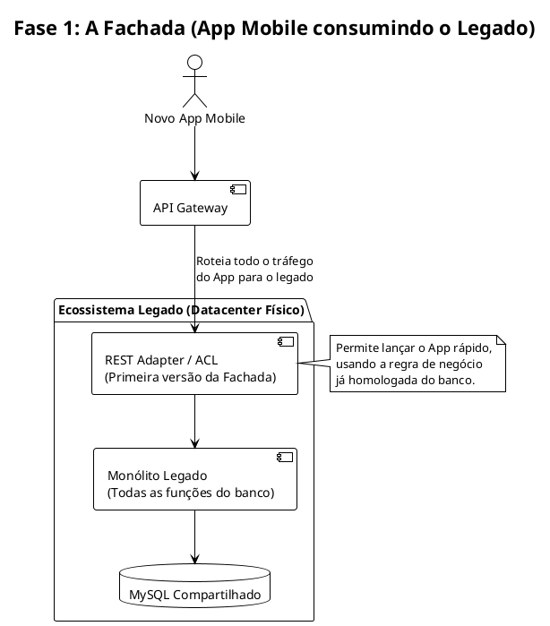
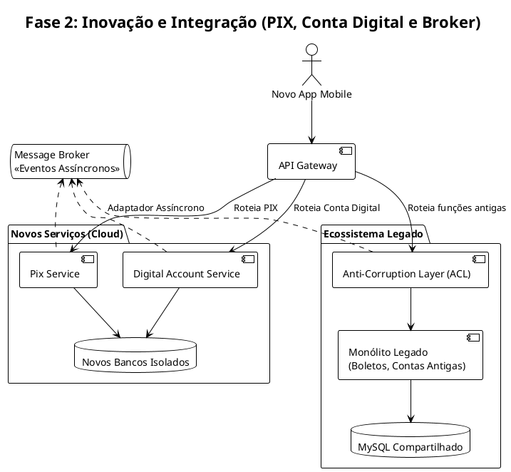
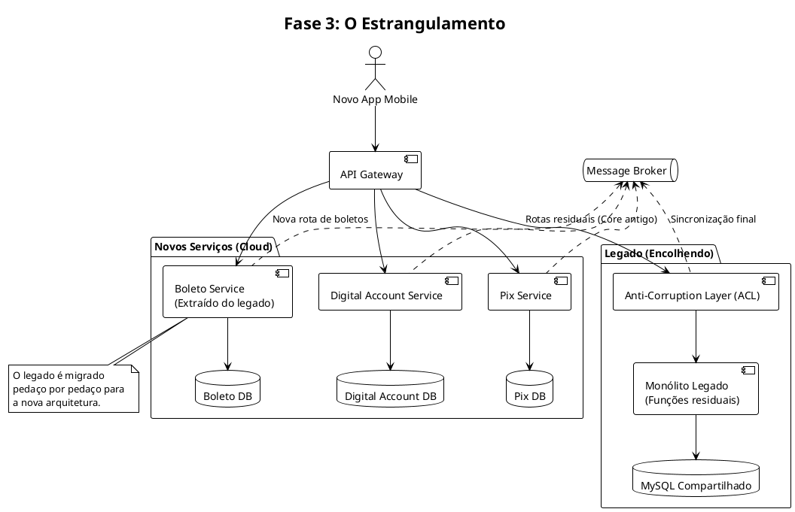

# PUC - Arquitetura de Microsserviços e Microcontainer: o Negócio como Serviço
Repositório para materiais da disciplina "Arquitetura de Microsserviços e Microcontainer: o Negócio como Serviço"

# Estudo de Caso - Banco Pinhão
## Arquitetura as-is


## Fase 1: A Fachada (App Mobile consumindo o legado)


## Fase 2: Inovação e Integração



## Fase 3: O Estrangulamento

@enduml
```
